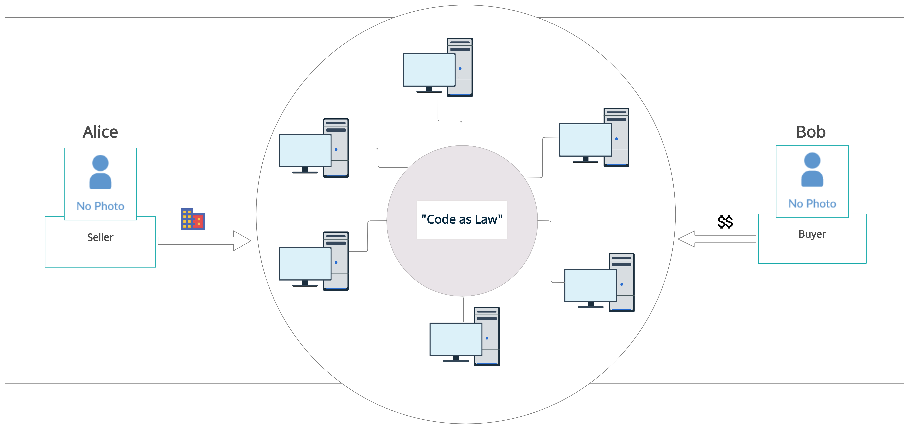

# Blockchain Real Estate Management System
## Introduction
- This is a simple system that applies Distributed Ledger Technology to Real Estate for record-keeping and transfer of ownership of assets.

## Overview and purpose
- Traditional Real Estate systems face a wide range of challenges. To name a few; 

	1. *Legal inconsistencies*.
	2. *Long and costly processes of proof and transfer ownership*.
	3. *Manual or centralized Siloed data*.
	4. *Weak data integrity **et cetera***.  

- These problems cause commercial Real Estate businesses to lose millions of money in profits. The reason is that the Commercial Real Estate industry constitutes a reasonably large portion of world economic asset and transaction activity.
- With the rise of Blockchain technology over the recent years, some of these problems have found solutions, like storing immutable data, proving and transferring ownership of assets, and much more.
- These benefits and many more usher in a new era of systems that can tokenize assets and offer decentralized services like P2P, therefore, benefiting the Real Estate Industry drastically and of-course other aspects of life.
- The purpose of this system is to use Blockchain technology to try and solve some of the challenges in the Real Estate industry to date.  

## System Content (System Boundaries)
- Here is a simple illustration of the transfer of ownership of an asset.

- In this transaction, if Bob has met code's law requirements, he will surely have Alice's assets transferred to him, and Alice, on the other hand, will end up with Bob's digital money for the exchange.
- However, if Bob fails to meet the code's law requirements, the transaction will not happen, and everybody's assets will remain as they were before the initialization of the transaction. 

## Interaction(Potential) of the product (with other products and components)
- Interpolation with the government's land and property system - for keeping a record of ownership and transfer of ownership.
- Banks for acquiring loans - using your digitally owned properties and lands as collateral for loans.
- Interpolation with tax authority system for tracking of assets owned by an individuals and ease filling of returns.  

## Product features (short description)
- Digitization/Tokenization Real Estate assets - Converting real-world real estate assets into digital assets.
- Real-Time Tracking of assets.
- Durability - Data that is durable and immutable.
- Secure Data Sharing - Improved transparency. 

## Security requirements 

## Characteristics of the user(who is the end-user of the system)
- Commercial Real Estate industries and Property owners.
- Banks.
- Investors.
- People with an interest in property ownership.  

## Restrictions